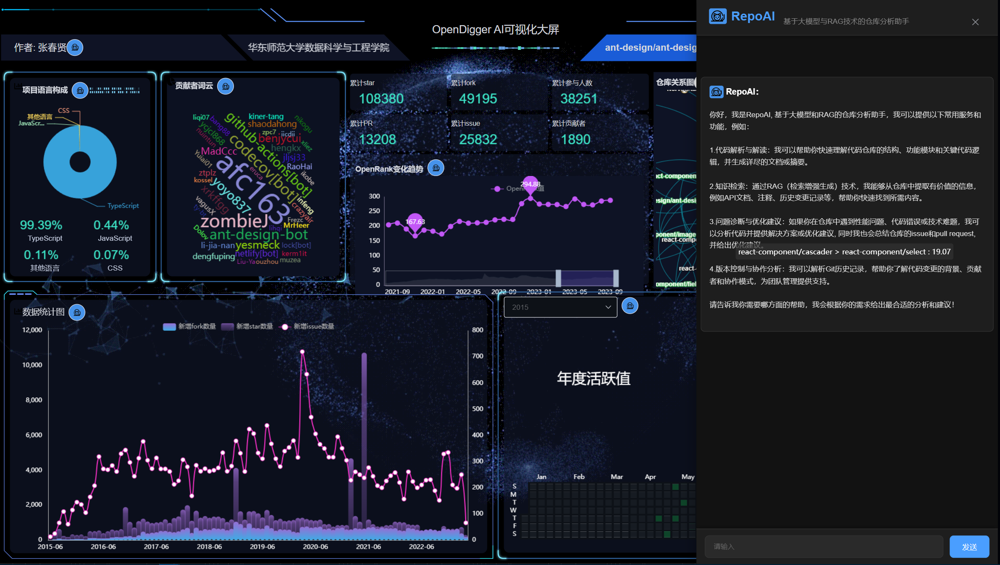
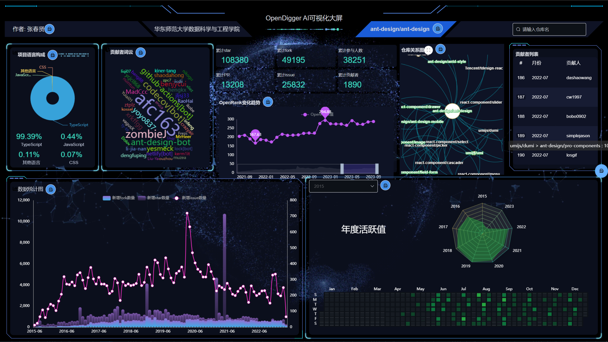
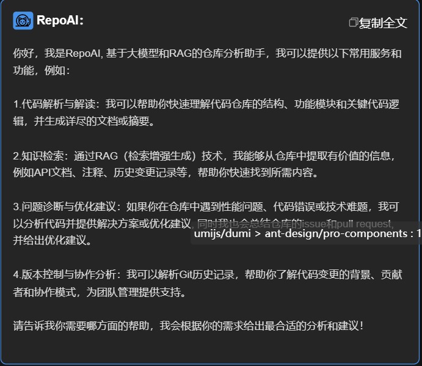
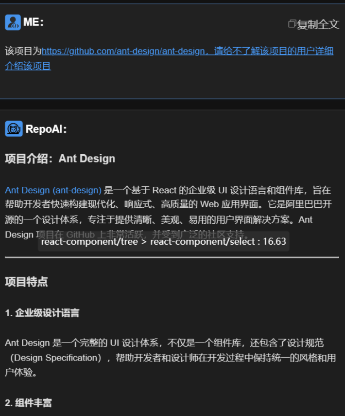
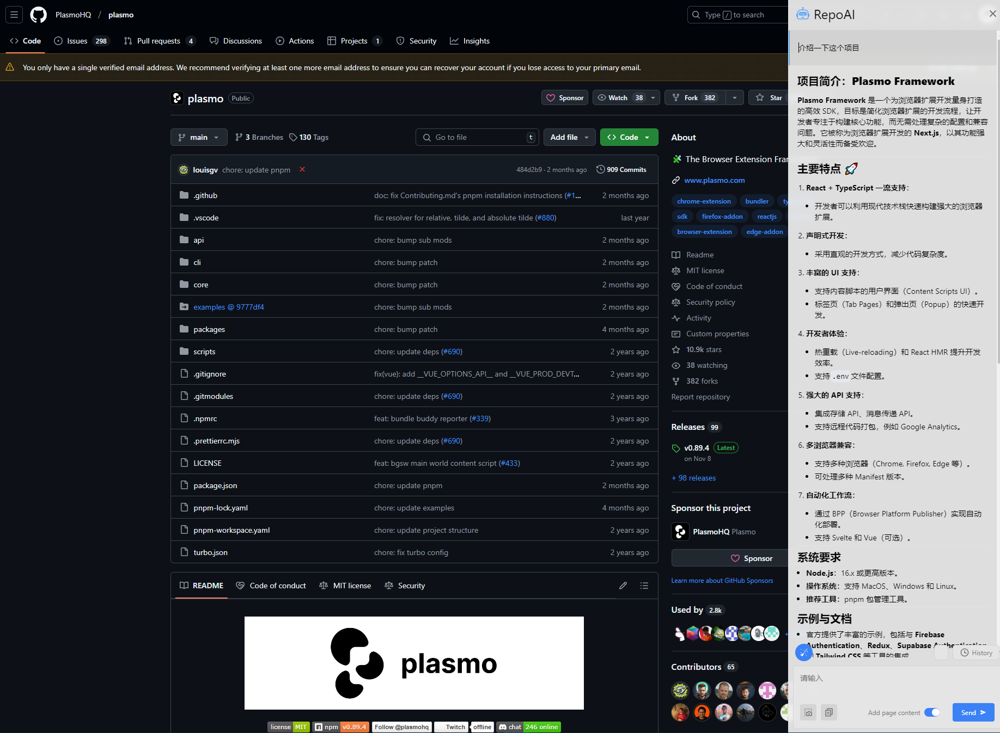

# OpenDigger AI 可视化大屏项目

详细信息请查看 `无监督学习队_复赛PPT.pptx`和`无监督学习队作品展示视频_2024_12_31_05_09_11_575.mp4`



## 项目简介

这是无监督学习队参加 OpenRank 大赛的参赛作品。项目包含两个主要部分:

1. **OpenDigger AI 可视化大屏** - 主要参赛作品,一个基于 Vue 的可视化数据大屏展示系统
2. **Wikipedia-semantic-search** - OpenDigger AI 可视化大屏中 RepoAI 功能的后端支持系统

## 技术栈

- 前端: Vue 2.6, Echarts 5.3, Element UI

- AI 模型: 基于大语言模型

- RAG 系统: Wikipedia-semantic-search

- 数据来源: X-lab2017/open-digger API, Github API

## 快速开始

### 安装依赖

```bash
cd ./OpenDigger_AI_Screen
pnpm i
```

### 运行项目

```bash
pnpm run serve
```



## 项目特点

1. **在线可访问**: 通过 http://opendigger.ohmyai.top 即可在线访问

2. **动态交互**: 支持实时查询不同开源项目的数据可视化展示

3. **丰富的数据展示**:
   - 项目语言构成分析
   - 仓库网络关系图
   - OpenRank 趋势分析
   - 贡献者邮箱分布
   - 贡献者活跃度排行
   - 项目基本信息统计

## RepoAI 核心功能

   

### 1. 代码解析与解读
   - 快速理解代码仓库结构
   - 分析功能模块和关键逻辑
   - 自动生成详尽文档和摘要

### 2. 智能知识检索
   - 基于 RAG 技术的信息提取
   - 快速检索 API 文档和注释
   - 历史变更记录分析

### 3. 问题诊断与优化
   - 性能问题分析
   - 代码错误诊断
   - Issue 和 PR 总结分析
   - 优化建议生成

### 4. 版本控制与协作分析
   - Git 历史记录解析
   - 代码变更背景分析
   - 贡献者画像
   - 团队协作模式分析

   

## RepoAI 浏览器插件



安装插件后, 在任意网站点击插件, 即可使用RepoAI实时聊天. 建议在Github打开, 并开启Add page content按键.

RepoAI 浏览器插件让用户在浏览器随时随地使用RepoAI.

### 如何安装

1. 克隆该仓库/通过点击“Clone”按钮下载。
2. 在RepoAI_chrome_extension文件夹运行 `yarn build`，这会创建一个 `dist` 文件夹（确保您的设备上已安装 Node.js 和 Yarn）。
3. 打开 Google Chrome 并在地址栏中输入 `chrome://extensions/` 进入“扩展程序”页面。
4. 通过切换页面右上角的开关，开启“开发者模式”。
5. 点击页面左上角的“加载已解压的扩展程序”按钮。
6. 选择 `dist` 文件夹。

## 项目意义

本项目从视觉角度展现开源项目的发展状况,让更多人能够直观地了解开源项目,降低了解开源的门槛。通过数据可视化和 AI 分析的方式,使普通用户也能快速理解开源项目的价值和发展趋势。

## 团队

无监督学习队 - 来自华东师范大学数据科学与工程学院

## 更多信息

详细信息请参考 `无监督学习队_复赛PPT.pptx`和`无监督学习队作品展示视频_2024_12_31_05_09_11_575.mp4`